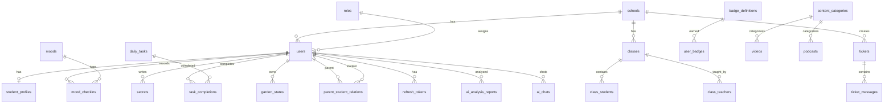

# Loko Backend — راهنمای معماری و توسعه

> **تأیید معماری**
> - ✓ Backend: Node.js + Express.js
> - ✓ Database: MySQL 8.0
> - ✓ Cache/Session: Redis 7
> - ✓ بدون NestJS، Prisma، MongoDB، PostgreSQL

---

## فهرست

1. [System Architecture](#1-system-architecture)
2. [High Level Design](#2-high-level-design)
3. [Folder Structure](#3-folder-structure)
4. [Database Schema](#4-database-schema)
5. [ERD Relationships](#5-erd-relationships)
6. [Migration Strategy](#6-migration-strategy)
7. [Seed Data Strategy](#7-seed-data-strategy)
8. [API Endpoints](#8-api-endpoints)
9. [Middleware Design](#9-middleware-design)
10. [Authentication Flow](#10-authentication-flow)
11. [Authorization Flow](#11-authorization-flow)
12. [Permission Matrix](#12-permission-matrix)
13. [Business Rules](#13-business-rules)
14. [Mood Algorithm](#14-mood-algorithm)
15. [Podcast Selection Algorithm](#15-podcast-selection-algorithm)
16. [Task & Reward Engine](#16-task--reward-engine)
17. [Garden Engine](#17-garden-engine)
18. [AI Engine](#18-ai-engine)
19. [Ticket System](#19-ticket-system)
20. [Excel Import Flow](#20-excel-import-flow)
21. [Reporting System](#21-reporting-system)
22. [Redis Usage Strategy](#22-redis-usage-strategy)
23. [Security Strategy](#23-security-strategy)
24. [Logging Strategy](#24-logging-strategy)
25. [Audit Strategy](#25-audit-strategy)
26. [Sample Production-Ready Code](#26-sample-production-ready-code)
27. [Deployment Architecture](#27-deployment-architecture)
28. [MVP Roadmap](#28-mvp-roadmap)
29. [Scalable Version Roadmap](#29-scalable-version-roadmap)

---

## 1. System Architecture

```
┌─────────────────────────────────────────────────────────────────┐
│                     React Frontend (موجود)                       │
└────────────────────────────┬────────────────────────────────────┘
                             │ HTTPS / REST API v1
                             ▼
┌─────────────────────────────────────────────────────────────────┐
│                    Express.js API Server                         │
│  ┌──────────┐ ┌──────────┐ ┌──────────┐ ┌──────────────────┐   │
│  │Middleware│ │ Routes   │ │Controllers│ │ Engines/Services │   │
│  └──────────┘ └──────────┘ └──────────┘ └──────────────────┘   │
└────────┬───────────────────────────────┬──────────────────────┘
         │                               │
         ▼                               ▼
┌─────────────────┐             ┌─────────────────┐
│   MySQL 8.0     │             │   Redis 7       │
│  (Primary DB)   │             │ Cache/Session/  │
│  Multi-Tenant   │             │ Rate Limit      │
└─────────────────┘             └─────────────────┘
         │
         ▼
┌─────────────────┐
│  File Storage   │
│  (uploads/)     │
└─────────────────┘
```

**لایه‌ها:**
| لایه | مسئولیت |
|------|---------|
| Routes | مسیریابی HTTP، نسخه‌بندی `/api/v1` |
| Controllers | تبدیل Request/Response، بدون منطق کسب‌وکار |
| Services | منطق CRUD، اعتبارسنجی tenant |
| Engines | منطق پیچیده: Mood, Task, Garden, AI, Podcast |
| Repositories | (فاز بعد) جداسازی کوئری‌های خام |
| Middleware | Auth, RBAC, Validation, Logging, Rate Limit |

---

## 2. High Level Design

### Multi-Tenant Model
- **Tenant Root:** `schools` — هر مدرسه یک tenant مستقل
- **Tenant Scope:** `school_id` روی `users`, `classes`, `tickets`, `imported_files`
- **Global Scope:** `team_admin` بدون محدودیت tenant
- **Row-Level Security:** در Service Layer با `tenantFilter` اعمال می‌شود

### ماژول‌های محصول
| ماژول | جداول کلیدی |
|-------|-------------|
| Loko Health | moods, mood_checkins, breathing_sessions, secrets, garden_* |
| Loko Club | daily_tasks, task_completions, points_transactions, token_*, badge_* |
| Loko TV | videos, content_categories, content_interactions |
| Loko Podcast | podcasts, content_categories, content_interactions |
| Loko AI | ai_analysis_reports, ai_chats |
| Educational Methods | educational_methods, method_statistics |
| Ticketing | tickets, ticket_messages |
| Admin | schools, users, imported_files, audit_logs |

---

## 3. Folder Structure

```
loko-backend/
├── docs/
│   └── ARCHITECTURE.md          # این سند
├── src/
│   ├── server.js                # Entry point
│   ├── app.js                   # Express app factory
│   ├── config/
│   │   ├── index.js             # Environment config
│   │   └── permissions.js       # RBAC definitions
│   ├── database/
│   │   ├── connection.js        # MySQL pool
│   │   ├── redis.js             # Redis client + key patterns
│   │   ├── migrate.js           # Migration runner
│   │   ├── seed.js              # Seed data
│   │   └── migrations/
│   │       └── 001_initial_schema.sql
│   ├── middleware/
│   │   ├── auth.js              # JWT verification
│   │   ├── authorize.js         # RBAC + tenant scope
│   │   ├── validate.js          # Joi validation
│   │   ├── rateLimiter.js       # Redis-backed rate limit
│   │   ├── accessLogger.js      # HTTP access logs
│   │   ├── errorHandler.js      # Global error handler
│   │   ├── requestId.js         # X-Request-Id
│   │   └── upload.js            # Multer file upload
│   ├── routes/v1/
│   │   └── index.js             # All v1 routes
│   ├── controllers/
│   │   └── index.js             # Request handlers
│   ├── services/
│   │   ├── auth.service.js
│   │   ├── token.service.js
│   │   ├── school.service.js
│   │   ├── user.service.js
│   │   ├── ticket.service.js
│   │   ├── secret.service.js
│   │   ├── content.service.js
│   │   ├── class.service.js
│   │   ├── report.service.js
│   │   ├── excelImport.service.js
│   │   └── audit.service.js
│   ├── engines/
│   │   ├── mood.engine.js
│   │   ├── podcast.engine.js
│   │   ├── task.engine.js
│   │   ├── garden.engine.js
│   │   ├── badge.engine.js
│   │   └── ai.engine.js
│   ├── validators/
│   │   └── schemas.js           # Joi schemas
│   └── utils/
│       ├── logger.js
│       ├── errors.js
│       ├── response.js
│       ├── crypto.js
│       └── sanitize.js
├── uploads/                     # Media & Excel files
├── logs/                        # Winston log files
├── docker-compose.yml
├── Dockerfile
├── package.json
└── .env.example
```

---

## 4. Database Schema

### جدول `users`
| Field | Type | Constraints |
|-------|------|-------------|
| id | BIGINT UNSIGNED | PK, AUTO_INCREMENT |
| school_id | BIGINT UNSIGNED | FK → schools, NULL for team_admin |
| role_id | TINYINT UNSIGNED | FK → roles, NOT NULL |
| username | VARCHAR(100) | UNIQUE, NOT NULL |
| password_hash | VARCHAR(255) | NOT NULL |
| plain_password | VARCHAR(100) | برای نمایش توسط Admin |
| first_name, last_name | VARCHAR(100) | NOT NULL |
| is_active | TINYINT(1) | DEFAULT 1 |
| deleted_at | TIMESTAMP | Soft Delete |
| created_at, updated_at | TIMESTAMP | Auto |

**Indexes:** `uk_users_username`, `idx_users_school_role`, `idx_users_deleted`

### جدول `schools` (Tenant Root)
| Field | Type | Constraints |
|-------|------|-------------|
| id | BIGINT UNSIGNED | PK |
| name | VARCHAR(200) | NOT NULL |
| code | VARCHAR(50) | UNIQUE — برای تولید username |
| is_active | TINYINT(1) | DEFAULT 1 |
| deleted_at | TIMESTAMP | Soft Delete |
| settings | JSON | تنظیمات مدرسه |

### جدول `mood_checkins`
| Field | Type | Constraints |
|-------|------|-------------|
| id | BIGINT UNSIGNED | PK |
| user_id | BIGINT UNSIGNED | FK → users |
| mood_id | TINYINT UNSIGNED | FK → moods |
| is_first_of_day | TINYINT(1) | تعیین پادکست روز |
| checkin_date | DATE | NOT NULL |
| note | TEXT | اختیاری |

**Indexes:** `idx_mc_user_date`, `idx_mc_user_created`

### سایر جداول
تمام ۳۶ جدول در `src/database/migrations/001_initial_schema.sql` تعریف شده‌اند:
`roles`, `classes`, `class_students`, `class_teachers`, `student_profiles`,
`parent_student_relations`, `moods`, `breathing_sessions`, `secrets`,
`daily_tasks`, `task_completions`, `points_transactions`, `token_wallets`,
`token_transactions`, `badge_definitions`, `user_badges`, `garden_states`,
`garden_plants`, `videos`, `podcasts`, `content_categories`,
`content_interactions`, `ai_analysis_reports`, `ai_chats`, `tickets`,
`ticket_messages`, `educational_methods`, `method_statistics`,
`imported_files`, `notifications`, `refresh_tokens`, `audit_logs`,
`access_logs`, `schema_migrations`

### Soft Delete Strategy
| Entity | Strategy |
|--------|----------|
| schools, users, classes | `deleted_at` timestamp |
| class_students (visibility) | `is_visible = 0` + `deleted_at` |
| secrets, videos, podcasts | `deleted_at` |
| students حذف‌شده توسط teacher/admin | رکورد باقی می‌ماند، فقط invisible |

---

## 5. ERD Relationships



---

## 6. Migration Strategy

1. فایل‌های SQL در `src/database/migrations/` با پیشوند شماره‌ای: `001_`, `002_`
2. جدول `schema_migrations` نسخه‌های اعمال‌شده را ردیابی می‌کند
3. اجرا: `npm run migrate`
4. هر migration در یک Transaction اجرا می‌شود
5. Rollback: migration معکوس دستی (فاز بعد: down migrations)
6. Production: migration قبل از deploy اجرا شود، هرگز در runtime

---

## 7. Seed Data Strategy

اجرا: `npm run seed`

| داده | توضیح |
|------|-------|
| roles | 5 نقش سیستم |
| moods | good, normal, bad |
| educational_methods | 4 روش آموزشی |
| badge_definitions | مدال‌های اولیه |
| content_categories | دسته‌بندی پادکست/ویدیو |
| team_admin | `loko_admin` / `Admin@12345` (فقط dev) |

**قوانین:**
- Seed idempotent با `INSERT IGNORE`
- Production: فقط roles/moods/methods/badges/categories
- هرگز password واقعی در production seed نشود

---

## 8. API Endpoints

Base URL: `/api/v1`

### Auth
| Method | Path | Role | Description |
|--------|------|------|-------------|
| POST | `/auth/login` | Public | ورود |
| POST | `/auth/refresh` | Public | تمدید توکن |
| POST | `/auth/logout` | Any | خروج |
| GET | `/auth/me` | Any | پروفایل جاری |

### Schools (Team Admin)
| POST | `/schools` | ایجاد مدرسه |
| GET | `/schools` | لیست مدارس |
| GET | `/schools/:id` | جزئیات |
| PUT | `/schools/:id` | ویرایش |
| DELETE | `/schools/:id` | Soft delete |

### Users
| GET | `/schools/:schoolId/users` | لیست کاربران |
| POST | `/schools/:schoolId/users` | ایجاد کاربر |
| GET | `/users/:id/password` | مشاهده رمز (Admin) |
| POST | `/users/:id/reset-password` | Reset رمز |
| DELETE | `/users/:id` | Soft delete دانش‌آموز |

### Classes
| GET | `/schools/:schoolId/classes` | لیست کلاس‌ها |
| POST | `/schools/:schoolId/classes` | ایجاد کلاس |
| GET | `/classes/:id` | جزئیات + دانش‌آموزان |

### Import
| POST | `/import/excel` | آپلود Excel (multipart) |

### Loko Health
| GET | `/mood/prompt` | وضعیت نمایش مودال |
| POST | `/mood/checkin` | ثبت مود |
| GET | `/mood/history` | تاریخچه مود |
| POST | `/breathing/sessions` | ثبت تمرین تنفس |
| GET | `/secrets` | لیست رازها |
| POST | `/secrets` | ایجاد راز |
| PUT | `/secrets/:id` | ویرایش |
| DELETE | `/secrets/:id` | حذف |
| GET | `/garden` | وضعیت باغچه |

### Loko Club
| POST | `/tasks/:taskId/complete` | تکمیل تسک |

### Loko TV / Podcast
| GET | `/videos` | لیست ویدیو |
| POST | `/videos` | آپلود (Team Admin) |
| GET | `/podcasts` | لیست پادکست |
| GET | `/podcasts/daily` | پادکست روز (بر اساس مود) |
| POST | `/content/interactions` | ثبت تعامل |

### AI
| POST | `/ai/analyze` | تحلیل Rule-Based |
| POST | `/ai/chat` | چت متنی |

### Tickets
| GET/POST | `/tickets` | لیست/ایجاد |
| POST | `/tickets/:id/reply` | پاسخ |
| PATCH | `/tickets/:id/status` | تغییر وضعیت |

### Reports
| GET | `/reports/global` | آمار کلی |
| GET | `/reports/school/:schoolId` | آمار مدرسه |
| GET | `/reports/class/:classId` | آمار کلاس |
| GET | `/reports/child/:childId` | آمار فرزند (Parent) |

### Audit
| GET | `/audit-logs` | لاگ‌های ممیزی |

**Response Format:**
```json
{
  "success": true,
  "data": {},
  "meta": { "pagination": { "total": 100, "page": 1, "limit": 20 } }
}
```

---

## 9. Middleware Design

| Middleware | Order | Function |
|------------|-------|----------|
| helmet | 1 | Security headers |
| cors | 2 | Cross-origin control |
| compression | 3 | Response compression |
| express.json | 4 | Body parsing |
| requestId | 5 | X-Request-Id |
| accessLogger | 6 | Log every request |
| rateLimiter | 7 | Global rate limit |
| authenticate | Route | JWT verification |
| authorize | Route | RBAC check |
| tenantScope | Route | Multi-tenant filter |
| validate | Route | Joi input validation |
| errorHandler | Last | Unified error response |

---

## 10. Authentication Flow

```
1. Client → POST /auth/login { username, password }
2. Server validates credentials (bcrypt)
3. Server generates:
   - Access Token (JWT, 15min, signed with JWT_ACCESS_SECRET)
   - Refresh Token (JWT, 7d, with jti + familyId)
4. Refresh token hash stored in MySQL + Redis
5. Client stores both tokens
6. Client sends Access Token in Authorization: Bearer header
7. On 401/expired → POST /auth/refresh { refreshToken }
8. Refresh Token Rotation:
   - Old token revoked
   - New pair issued with same familyId
   - If revoked token reused → entire family revoked (token theft detection)
9. Logout → revoke refresh token by jti
```

**قوانین:**
- Username/Password فقط توسط سیستم تولید می‌شوند
- کاربر نمی‌تواند خودش تغییر دهد
- Reset فقط توسط Team Admin / School Admin

---

## 11. Authorization Flow

```
1. authenticate middleware → req.user = { id, role, schoolId }
2. authorize(permission) → check ROLE_PERMISSIONS[role]
3. tenantScope → req.tenantFilter = { schoolId } (except team_admin)
4. Service layer → filter queries by schoolId
5. Resource-level check → e.g. parent can only see own child
```

---

## 12. Permission Matrix

| Permission | Team Admin | School Admin | Teacher | Student | Parent |
|------------|:---:|:---:|:---:|:---:|:---:|
| schools:write | ✓ | | | | |
| users:write | ✓ | ✓ | | | |
| users:view_password | ✓ | ✓ | | | |
| users:reset_password | ✓ | ✓ | | | |
| users:delete | ✓ | ✓ | ✓ | | |
| import:excel | ✓ | ✓ | | | |
| mood:write | | | | ✓ | |
| mood:read_students | ✓ | ✓ | ✓ | | |
| secrets:manage_own | | | | ✓ | |
| tasks:complete | | | | ✓ | |
| content:read | ✓ | ✓ | ✓ | ✓ | |
| content:write | ✓ | | | | |
| ai:chat | | | | ✓ | |
| ai:reports_read | ✓ | ✓ | ✓ | | |
| tickets:create | ✓ | ✓ | | ✓ | |
| tickets:respond | ✓ | | | | |
| reports:school | ✓ | ✓ | | | |
| reports:class | | | ✓ | | |
| reports:child | | | | | ✓ |
| audit:read | ✓ | | | | |

---

## 13. Business Rules

1. **کاربران:** فقط Team Admin و School Admin می‌توانند ایجاد کنند
2. **Username:** `{schoolCode}_{firstName}{lastName}{sequence}` — یکتا سازی خودکار
3. **Password:** 10 کاراکتر تصادفی، ذخیره hash + plain برای admin
4. **حذف دانش‌آموز:** Soft delete — `users.deleted_at` + `class_students.is_visible = 0`
5. **مود روز:** اولین checkin روز، پادکست را قفل می‌کند
6. **تسک:** هر تسک فقط یک‌بار در روز قابل تکمیل
7. **رازها:** فقط صاحب دسترسی دارد، برای AI استفاده می‌شود
8. **Parent:** فقط read-only گزارش فرزند
9. **تیکت:** School Admin + Student ایجاد، Team Admin پاسخ

---

## 14. Mood Algorithm

**فایل:** `src/engines/mood.engine.js`

```
Input: userId
Output: { shouldPrompt, lastMood, lastCheckinAt }

1. Check Redis cache (TTL 5min)
2. Get last mood_checkin for user
3. If no checkin → shouldPrompt = true
4. If checkin_date != today → shouldPrompt = true (first login of day)
5. If hours_since_last >= 4 → shouldPrompt = true
6. Else → shouldPrompt = false
7. Cache result in Redis
```

**ثبت مود:**
- اگر اولین مود روز → `is_first_of_day = 1`
- Cache پادکست روز invalidate می‌شود
- Garden engine: +5 experience

---

## 15. Podcast Selection Algorithm

**فایل:** `src/engines/podcast.engine.js`

```
Input: userId
Output: { podcast, moodSlug, lockedForDay }

1. Check Redis: daily_podcast:{userId}:{date}
2. Get FIRST mood of today (is_first_of_day = 1)
3. If no mood → return { podcast: null, reason: 'no_mood_today' }
4. Map mood → category:
   - good → motivational
   - normal → educational
   - bad → calming
5. SELECT random active podcast matching mood_slug OR category
6. Cache in Redis (TTL 24h)
7. Mood changes later in day do NOT change podcast
```

---

## 16. Task & Reward Engine

**فایل:** `src/engines/task.engine.js`

```
completeTask(userId, taskId):
1. Validate task exists and is active
2. Check not already completed today (unique: task_id + user_id + date)
3. Insert task_completion
4. Award points → student_profiles.total_points + points_transactions
5. Award tokens → token_wallets + token_transactions
6. Check badge criteria (task count)
7. Return { pointsAwarded, tokensAwarded }
```

**Point Transaction:** هر تغییر امتیاز یک رکورد immutable در `points_transactions`

---

## 17. Garden Engine

**فایل:** `src/engines/garden.engine.js`

```
Activity Rewards:
- mood_checkin: +5 XP
- task_complete: +15 XP + seed plant
- breathing_session: +10 XP
- video/podcast complete: +8 XP
- secret_write: +3 XP

Level Thresholds: [0, 100, 250, 500, 1000, 2000, 5000]
Level up → auto flower plant

State: garden_states (level, experience, layout JSON)
Plants: garden_plants (seed/flower/item)
```

---

## 18. AI Engine

**فایل:** `src/engines/ai.engine.js` — Rule-Based (نسخه ۱)

**تحلیل هفتگی:**
```
Inputs: mood history (14d), secrets count, weekly tasks, garden level
Rules:
- bad_ratio > 50% → moodStatus = 'needs_attention'
- good_ratio > 60% → moodStatus = 'positive'
- else → 'stable'
Suggestions based on ratios
Output saved to ai_analysis_reports
```

**چت:**
- Keyword matching (سلام، حالم بد، خوبم)
- Fallback: بر اساس آخرین مود
- تاریخچه در `ai_chats` با `session_id`

---

## 19. Ticket System

**وضعیت‌ها:** `open` → `in_progress` → `answered` → `closed`
**اولویت‌ها:** `low`, `medium`, `high`, `critical`

```
Create: School Admin / Student → status = open
Reply by Team Admin → status = answered
Reply by Creator → status = open
Status change: only Team Admin
All messages stored in ticket_messages (immutable)
```

---

## 20. Excel Import Flow

**فایل:** `src/services/excelImport.service.js`

```
1. School Admin uploads .xlsx (multipart)
2. Record in imported_files (status: processing)
3. Parse with xlsx library
4. Required columns: first_name, last_name, role, class_name, grade
5. For each row:
   a. Validate
   b. Create class if not exists
   c. Generate unique username
   d. Generate password
   e. Create user + profile/wallet/garden (if student)
   f. Assign to class
6. Collect errors per row
7. Update imported_files with report
8. Audit log
```

**فرمت Excel نمونه:**
| first_name | last_name | role | class_name | grade | national_code | phone |
|------------|-----------|------|------------|-------|---------------|-------|

---

## 21. Reporting System

| Report | Access | Data |
|--------|--------|------|
| Global | Team Admin | school count, user count, open tickets |
| School | School Admin | students, teachers, classes, mood distribution |
| Class | Teacher | student list, method statistics |
| Child | Parent | mood trend, weekly tasks, profile |

---

## 22. Redis Usage Strategy

| Key Pattern | TTL | Purpose |
|-------------|-----|---------|
| `refresh:{jti}` | 7d | Refresh token validation |
| `session:{userId}` | 15m | Session state |
| `mood_prompt:{userId}` | 5m | Mood modal status cache |
| `daily_podcast:{userId}:{date}` | 24h | Locked daily podcast |
| `permissions:{userId}` | 1h | Permission cache (future) |
| `rl:{ip}` | 15m | Rate limit counters |

---

## 23. Security Strategy

- **JWT:** Access 15min, Refresh 7d with rotation
- **Password:** bcrypt (12 rounds)
- **Helmet:** Security headers
- **CORS:** Whitelist origin
- **Rate Limiting:** Redis-backed, 100 req/15min global, 10 req/15min auth
- **Input:** Joi validation + XSS sanitization
- **SQL:** Parameterized queries only (mysql2 named placeholders)
- **Files:** MIME type validation, size limits
- **Audit:** All sensitive actions logged

---

## 24. Logging Strategy

**Winston** با دو transport:
- Console (development, colorized)
- Daily rotate files: `logs/app-*.log`, `logs/error-*.log`

**سطوح:** error, warn, info, debug
**هر request:** method, path, status, duration, userId, requestId
**Retention:** 30 روز app, 90 روز error

---

## 25. Audit Strategy

**جدول `audit_logs`:**
- چه کسی (user_id)
- چه کاری (action: `user.create`, `school.delete`, ...)
- روی چه چیزی (entity_type, entity_id)
- مقادیر قبل/بعد (old_values, new_values JSON)
- IP + User-Agent

**رویدادهای اجباری:** login, user CRUD, password reset, school CRUD, import, ticket reply, content upload

---

## 26. Sample Production-Ready Code

کد نمونه در این repository پیاده‌سازی شده:

| Component | Path |
|-----------|------|
| Server bootstrap | `src/server.js` |
| Auth + JWT rotation | `src/services/token.service.js` |
| RBAC middleware | `src/middleware/authorize.js` |
| Mood engine | `src/engines/mood.engine.js` |
| Excel import | `src/services/excelImport.service.js` |
| Error handling | `src/middleware/errorHandler.js` |
| DB migration | `src/database/migrations/001_initial_schema.sql` |

---

## 27. Deployment Architecture

```
                    ┌──────────────┐
                    │   Nginx      │
                    │  (SSL/TLS)   │
                    └──────┬───────┘
                           │
              ┌────────────┼────────────┐
              ▼            ▼            ▼
        ┌──────────┐ ┌──────────┐ ┌──────────┐
        │ API (x2) │ │ API (x2) │ │ API (x2) │
        │ Node 20  │ │ Node 20  │ │ Node 20  │
        └────┬─────┘ └────┬─────┘ └────┬─────┘
             │            │            │
             └────────────┼────────────┘
                          │
              ┌───────────┼───────────┐
              ▼           ▼           ▼
        ┌──────────┐ ┌────────┐ ┌──────────┐
        │ MySQL    │ │ Redis  │ │ Uploads  │
        │ Primary  │ │ Cluster│ │ (S3/NFS) │
        └──────────┘ └────────┘ └──────────┘
```

**Docker:** `docker-compose up -d` برای dev
**Production:** Kubernetes یا Docker Swarm با health check `/health`

---

## 28. MVP Roadmap

### فاز ۱ (هفته ۱-۲) — Foundation ✓
- [x] Project setup, Docker, migrations
- [x] Auth (JWT + Refresh rotation)
- [x] RBAC + Multi-tenant
- [x] School/User CRUD
- [x] Excel import

### فاز ۲ (هفته ۳-۴) — Core Features
- [x] Mood check-in + prompt logic
- [x] Breathing sessions
- [x] Secrets CRUD
- [x] Garden engine
- [x] Daily tasks + points/tokens
- [x] Daily podcast selection

### فاز ۳ (هفته ۵-۶) — Content & AI
- [x] Video/Podcast management
- [x] Content interactions
- [x] Rule-based AI analysis + chat
- [x] Ticket system
- [x] Reports (school/class/child)

### فاز ۴ (هفته ۷-۸) — Polish
- [ ] Integration tests
- [ ] API documentation (Swagger)
- [ ] Performance tuning
- [ ] Production deployment
- [ ] Frontend integration testing

---

## 29. Scalable Version Roadmap

| Phase | Enhancement |
|-------|-------------|
| v1.1 | Repository pattern, unit tests (>80% coverage) |
| v1.2 | Swagger/OpenAPI, webhook notifications |
| v1.3 | Bull queue for Excel import (async processing) |
| v2.0 | Read replicas for MySQL, Redis Cluster |
| v2.1 | S3/MinIO for media storage, CDN |
| v2.2 | Real AI integration (OpenAI/local LLM) |
| v2.3 | WebSocket for real-time notifications |
| v3.0 | Microservices split (Auth, Content, Analytics) |
| v3.1 | Event-driven architecture (RabbitMQ/Kafka) |
| v3.2 | Multi-region deployment, data residency |

---

*آخرین به‌روزرسانی: 2026-06-17*
